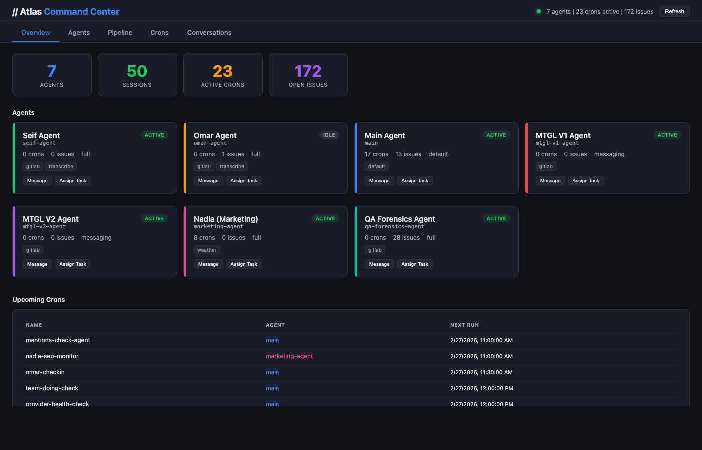

# Atlas Command Center

**Drop one file, get a real-time OpenClaw ops dashboard.**

Atlas Command Center is a lightweight, single-file dashboard for monitoring OpenClaw agent fleets in real time.
No build step. No database. No Docker. Just HTML + CSS + JS.



## Why Atlas?

Most tools in this space are built for enterprise stacks and heavy infra.
Atlas is for solo operators, small teams, and hobbyists who want visibility fast without spinning up half the internet.

## Features

- ⚡ **Single-file setup** — one HTML file, zero dependencies
- 👀 **Fleet visibility** — monitor agents at a glance
- ⏱️ **Auto-refresh every 30s** — always up-to-date without manual reloads
- 🗓️ **Cron monitoring** — track scheduled jobs and their state
- 🧵 **Session tracking** — keep an eye on active and recent sessions
- 🧱 **Pipeline / Kanban view** — visualize task flow and status
- 💬 **Conversation feed** — follow agent/user interactions in one place
- 🧰 **No infrastructure tax** — no Postgres, Redis, Docker, or orchestration required

## Quick Start

Serve the HTML file.

```bash
python3 -m http.server 8080
# then open http://localhost:8080
```

## Atlas vs mission-control

| Category | Atlas Command Center | openclaw-mission-control |
|---|---|---|
| Setup model | Single HTML file | Multi-service app |
| Dependencies | None | Postgres + Redis + Docker |
| Build step | None | Required |
| Runtime footprint | Tiny | Heavy (~30MB+ stack) |
| Best for | Solo operators, small teams, hobbyists | Enterprise / large-scale ops |
| Time to first dashboard | Minutes | Significantly longer |

## Roadmap

- [ ] Wire Message/Task modals to actual OpenClaw API
- [ ] Add basic auth (token/password)
- [ ] Cron run history per cron
- [ ] Session cost/token tracking
- [ ] Search/filter on conversations and crons
- [ ] Real-time WebSocket updates
- [ ] Agent activity timeline

## Contributing

PRs are welcome.

If you want to contribute:

1. Fork the repo
2. Make your changes (keep it lightweight and dependency-free)
3. Open a PR with a clear description

Issues, bug reports, and feature ideas are all appreciated.

## License

MIT License.

## Built by Noqta

Built by [Noqta (noqta.tn)](https://noqta.tn).
